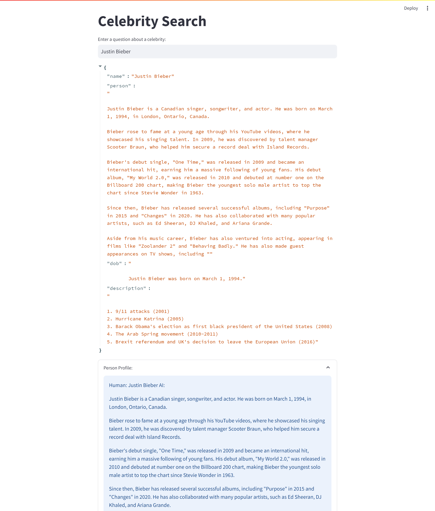

# Celebrity Search

## Overview
Celebrity Search is an interactive web application built with Streamlit and integrated with OpenAI's GPT models. It allows users to search for information about celebrities, including personal profiles and significant events related to their dates of birth.

## Features
- **Ask a Question**: Using `SimpleExample.py`, users can ask any question to be answered by OpenAI's GPT models.
- **Celebrity Search**: With `Search.py`, users can enter a celebrity's name and get detailed information including personal profiles and major world events around their date of birth.

## Installation
To run Celebrity Search, you need to have Python installed on your system. Follow these steps to set up the environment:

1. **Clone the Repository**
2. **Install Dependencies**
`pip install -r requirements.txt`

3. **Set Up OpenAI API Key**
- Obtain an API key from OpenAI.
- Create a file named `constants.py` and add the following line:
  ```python
  openai_key = 'your-openai-api-key'
  ```

4. **Run the Application**
- For the simple example:
  ```
  streamlit run SimpleExample.py
  ```
- For the celebrity search:
  ```
  streamlit run Search.py
  ```

## Usage
After starting the application:
- Navigate to the Streamlit web interface.
- Choose between asking a general question or searching for a celebrity.
- Enter your query or the name of a celebrity.
- View the results displayed on the page.


## Acknowledgments
- This project is inspired by Krish Naik's [Getting Started With LangChain in 20 Minutes](https://youtu.be/_FpT1cwcSLg?si=Y2SYlbkJL44J_Acy). It showcases my learning and adaptations in applying Langchain's functionalities.


## Screenshot of Generated Text

